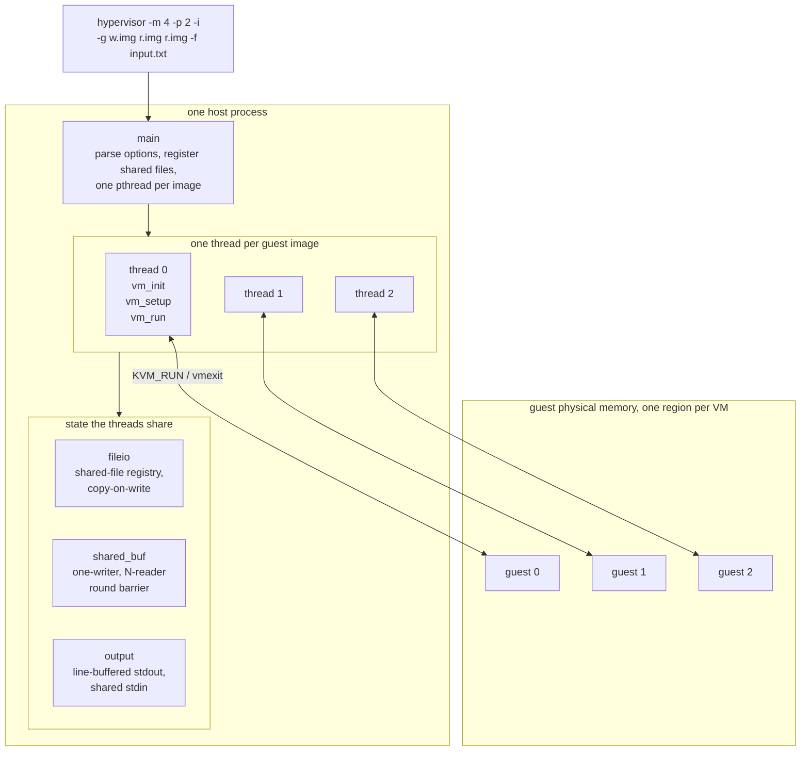
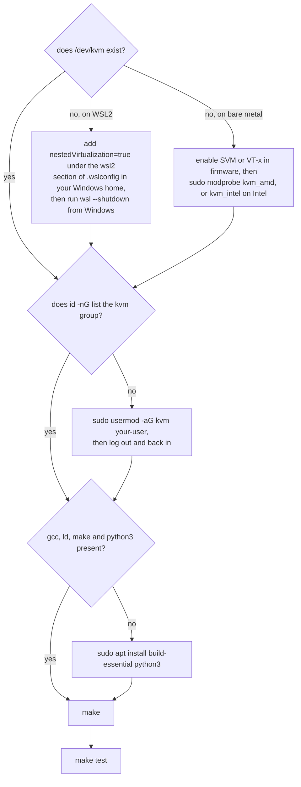
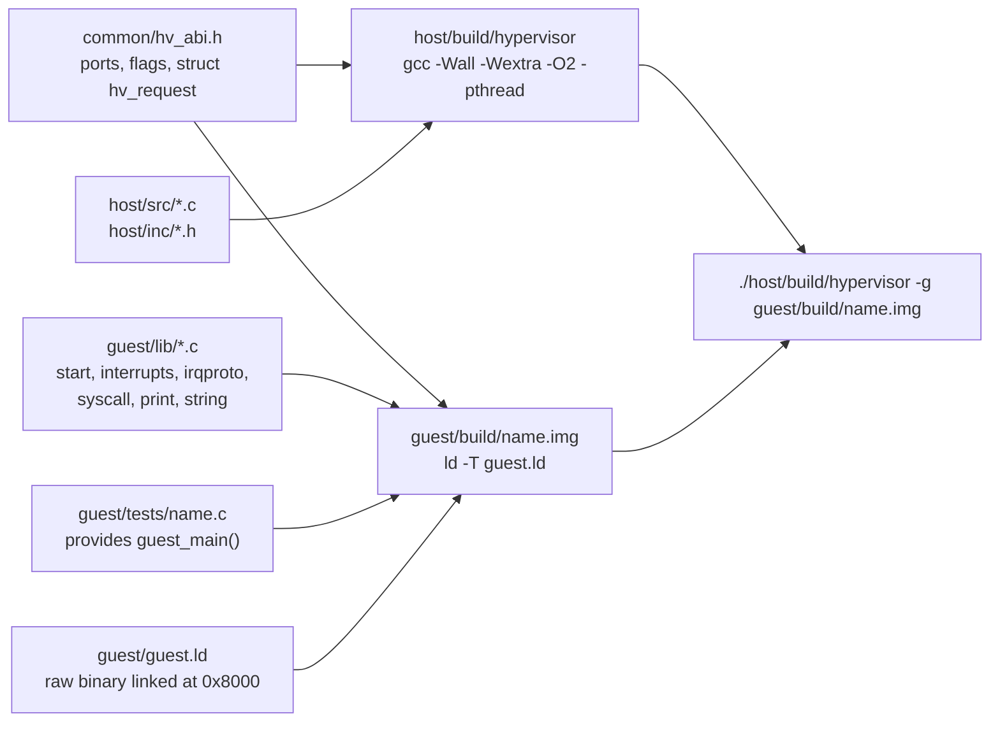
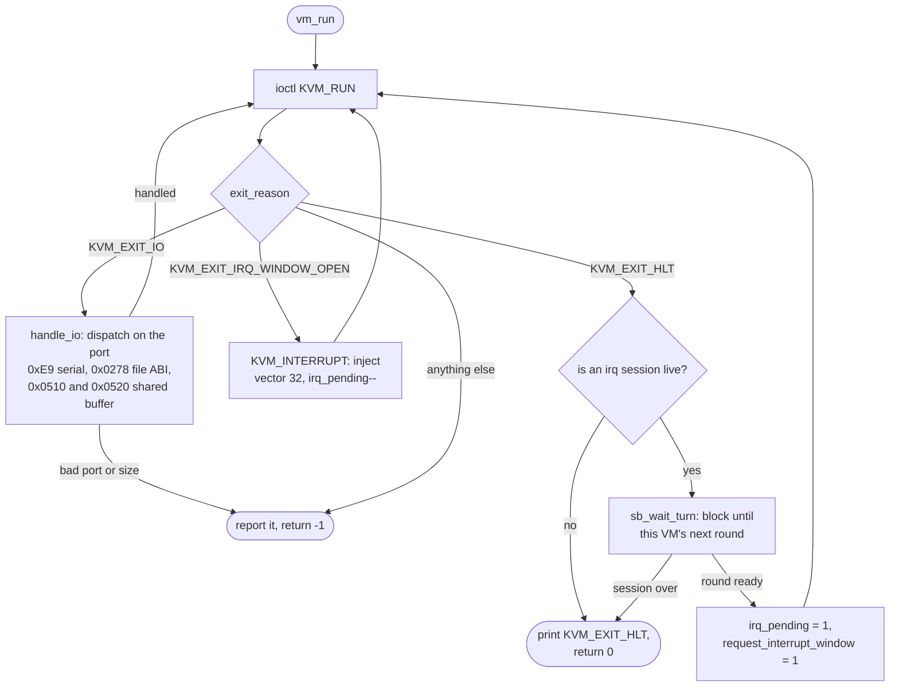
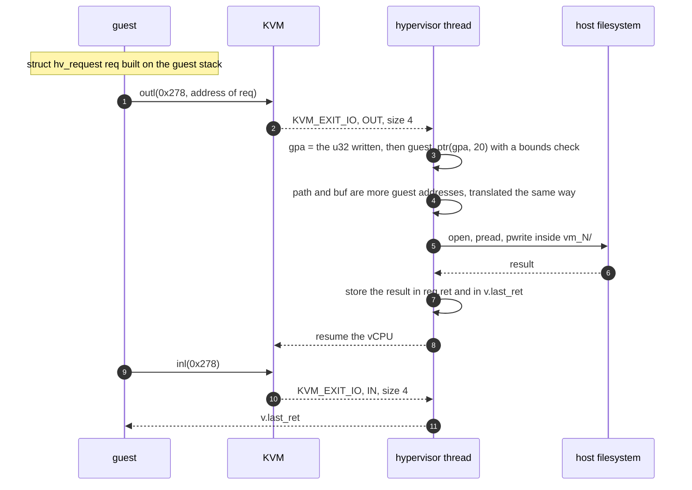
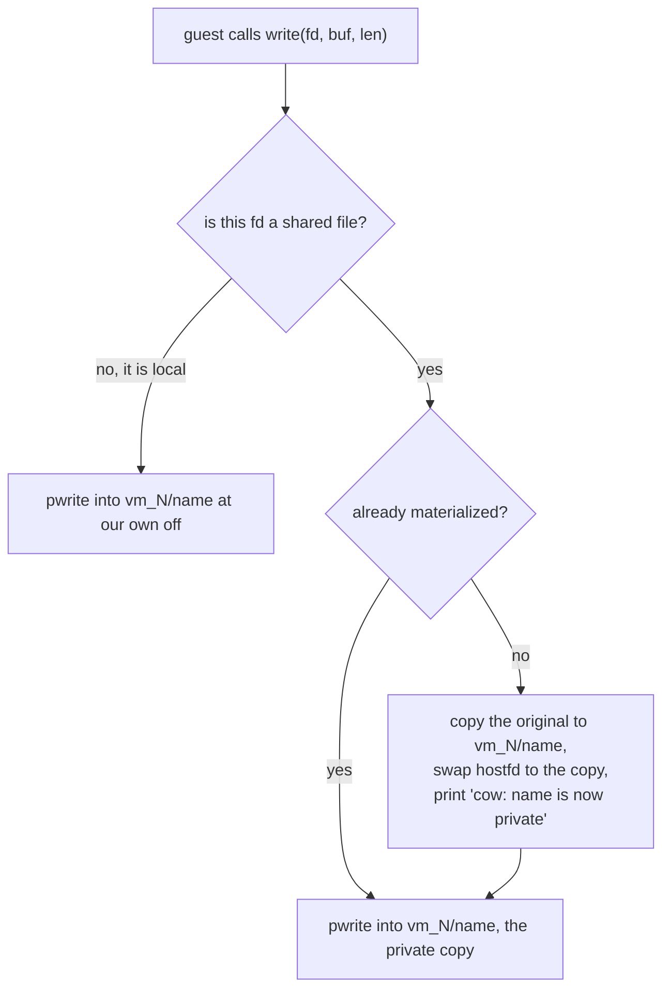
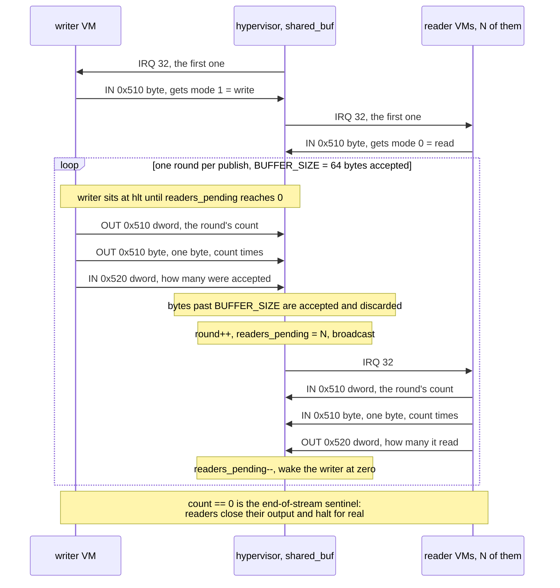

# nanovisor

A KVM-based hypervisor for the AOR2 course project. One host process runs *N*
guest VMs, one POSIX thread each, in 64-bit long mode. The guests are freestanding
raw binaries with no BIOS, no firmware and no libc; they reach the outside world
through four I/O ports: a serial console, a file ABI, and a hypervisor-owned
shared buffer driven by injected interrupts.

## The assignment

| Document | Format | What it is |
|---|---|---|
| [`docs/PROJECT_en.md`](docs/PROJECT_en.md) | Markdown | the project description, translated to English — the readable one |
| [`docs/PROJECT_sr.md`](docs/PROJECT_sr.md) | Markdown | the project description, Serbian original, in the examiner's words |
| [`docs/AOR2_2026_Projekat.pdf`](docs/AOR2_2026_Projekat.pdf) | PDF | the project description exactly as published by the course |
| [`docs/mods/AOR2_2026_Modifikacije.pdf`](docs/mods/AOR2_2026_Modifikacije.pdf) | PDF | the official modification sheet, one modification per phase |

<details>
<summary><strong>The assignment in brief</strong> — three parts, 45 points (click to expand)</summary>

> **A. Basic hypervisor features (15 points).** Extend the starter into a
> hypervisor that runs several guests at once, one thread per guest, with the
> guest memory size (2, 4 or 8 MB) and the page size (4 KB or 2 MB) given on the
> command line. Guests print to a serial console on port `0xE9` and read one byte
> at a time from the same port. A guest that dies must not take the others down.
>
> **B. File support (15 points).** Give guests `open`, `close`, `read`, `write`
> and `lseek` over the port ABI. Each guest sees its own private set of files;
> files named on the command line are shared between guests, but the first write
> from a guest gives that guest a private copy, leaving the original and the other
> guests untouched.
>
> **C. Interrupt support (15 points).** The hypervisor owns one shared buffer.
> One VM writes to it and the rest read from it, each told its role by the first
> injected interrupt. The hypervisor drives every transfer by injecting interrupts
> and enforces the barrier: the writer may not publish the next round until every
> reader has consumed the current one.

The three official modifications defended on top of this — 16 MB guests,
`SEEK_CUR` and `O_APPEND`, and a vector-33 stop — are translated in full in
[`docs/guide/README.md`](docs/guide/README.md).

</details>

---

## The shape of it



Every VM thread owns its `struct vm` and mutates nothing else; the three shared
modules are the only crossing points, and only one of them ever blocks a thread.
The implementation plan and its progress ledger are in
[`docs/ROADMAP.md`](docs/ROADMAP.md); every document and source file is mapped in
[`docs/INDEX.md`](docs/INDEX.md).

---

## Setup

The hypervisor needs Linux and a usable `/dev/kvm`. It does not build or run on
macOS or Windows directly; on Windows, use WSL2 with nested virtualization.



| Need | Check | Expected |
|---|---|---|
| KVM device | `ls -l /dev/kvm` | `crw-rw---- 1 root kvm ...` |
| your user in group `kvm` | `id -nG` | the list contains `kvm` |
| CPU virtualization visible | `grep -o -m1 -w 'svm\|vmx' /proc/cpuinfo` | `svm` (AMD) or `vmx` (Intel) |
| KVM module loaded | `lsmod \| grep kvm` | `kvm_amd` or `kvm_intel`, plus `kvm` |
| C toolchain | `gcc --version; ld --version; make --version` | any recent GCC, binutils, GNU make |
| `python3` | `python3 --version` | any 3.x — only the phase C suite and demo use it |
| coreutils | `command -v timeout cmp diff mktemp` | four paths |

The full checklist, with a fix for every row, is
[`docs/guide/RUNNING.md`](docs/guide/RUNNING.md) section 1.

> **Never** create an in-kernel irqchip here (`KVM_CREATE_IRQCHIP`,
> `KVM_CREATE_PIT2`). This project injects interrupts with `KVM_INTERRUPT`, which
> stops working the moment an irqchip exists — see design decision **D7**.

### Build

```sh
make                 # builds host/build/hypervisor and every guest/build/*.img
make host            # host only
make guest           # guest only
make test            # phase 0 gate + phase A, B, C suites
make clean
```



Header dependencies are tracked with `-MMD`, so editing a header rebuilds what
includes it and `make clean` is never needed for correctness. Dropping a new
`guest/tests/<name>.c` with a `guest_main()` into the tree is the whole procedure
for adding a guest image — `guest/lib/start.c` owns `_start`. `make -C guest debug`
emits the same links as ELF (`guest/build/<name>.elf`) for `readelf -S`.

---

## Running

```
usage: hypervisor -g <image> [image...] [options]

  -m, --memory <2|4|8>        guest memory size in MB (default 2)
  -p, --page   <4|2>          page size, 4 for 4KB or 2 for 2MB (default 4)
  -g, --guest   [img...] guest images; one VM is launched per image
  -f, --file   <f> [f...]     files shared between VMs
  -i, --irq                   run the shared-buffer interrupt session
  -w, --writer <id>           VM that writes to the shared buffer (default 0)
  -v, --verbose               trace shared-buffer rounds
  -h, --help                  this message
```

`-g` and `-f` take several operands in a row; the list ends at the next option.

```sh
# A: two VMs, one thread each
./host/build/hypervisor --memory 4 --page 2 \
    --guest guest/build/hello.img guest/build/hello.img

# B: two guests sharing a file; each write triggers a private copy
printf 'shared file original contents\n' > shared.txt
./host/build/hypervisor -m 4 -p 2 \
    -g guest/build/file_shared.img guest/build/file_shared2.img -f shared.txt
cat shared.txt vm_0/shared.txt vm_1/shared.txt

# C: one writer streams input.txt to two readers through the shared buffer
python3 -c "open('input.txt','w').write('X'*200)"
./host/build/hypervisor -m 4 -p 2 -i \
    -g guest/build/irq_writer.img guest/build/irq_reader.img guest/build/irq_reader.img \
    -f input.txt
cmp input.txt vm_1/out.txt && cmp input.txt vm_2/out.txt && echo identical
```

`-i`, `-w` and `-v` are additions to the assignment's option set. **The phase C
session only starts with `-i`**, which is what keeps every phase A and B demo
running unchanged — without it a `hlt` still terminates the VM immediately (see
**D5**).

Every line of guest output carries a `[vm N]` prefix. `[vm N] KVM_EXIT_HLT` is a
normal end; `[vm N] unexpected exit: ...` plus a register dump means that VM died
and the others carried on. Each VM gets a `vm_<id>/` directory in the working
directory for its local files, left on disk for inspection. What each message
means is catalogued in [`docs/guide/RUNNING.md`](docs/guide/RUNNING.md) section 3.

---

## Repository layout

```
common/hv_abi.h        the guest/host ABI, included verbatim by both sides
host/                  the hypervisor
  inc/ src/              opts, vm, fileio, shared_buf, output
guest/
  inc/                   headers
  lib/                   linked into every image: start, interrupts, irqproto,
                         syscall, print, string
  tests/                 one image per file: guest/build/<name>.img
  guest.ld               raw-binary link script
scripts/               test suites and the defense demos
  expected/phase0.txt    golden output for the phase 0 regression gate
docs/                  the assignment, the roadmap, the defense material
  guide/                 setup, running, and one page per official modification
  mods/                  the official modification sheet and the examiners' tests
```

---

## How it works

### The vCPU loop

`vm_run()` is the whole hypervisor in one loop: enter the guest, decode why it
left, service it, re-enter. Everything the guest can do to the outside world
arrives here as a `KVM_EXIT_IO`, and what each port means is the
[ports table](#ports) below.



### Guest memory map

`[0, mem_size)` is identity mapped, so **GVA == GPA**. The region below the guest
image is reserved for hypervisor-owned structures:

```
0x000000  unused
0x001000  PML4
0x002000  PDPT
0x003000  PD
0x004000  PT[0]  ┐  4 KB paging only. mem_size/4096 PTEs means
0x005000  PT[1]  │  512 / 1024 / 2048 entries for 2 / 4 / 8 MB,
0x006000  PT[2]  │  so 1 / 2 / 4 tables — exactly what fits below
0x007000  PT[3]  ┘  the guest.
0x008000  guest image (linked at this address), then .bss
   ...    free
mem_size  initial rsp; the stack grows down
```

With 2 MB pages only PML4+PDPT+PD are used, with `PDE64_PS` set on 1 / 2 / 4 PD
entries. The guest recovers `mem_size` from its initial `rsp`, rounded up to the
next 2 MB boundary — no extra port, nothing hardcoded.

### Ports

| Port | Dir | Width | Meaning |
|---|---|---|---|
| `0xE9` | OUT | 1 | serial output: one character to the console |
| `0xE9` | IN | 1 | serial input: one byte of the hypervisor's stdin, 0 at EOF |
| `0x0278` | OUT | 4 | address of a `struct hv_request` in guest memory |
| `0x0278` | IN | 4 | result of the request just submitted |
| `0x0510` | IN | 1 | *first interrupt only*: the assigned mode (0 read, 1 write) |
| `0x0510` | OUT | 4 | writer: how many bytes this round carries |
| `0x0510` | OUT | 1 | writer: one byte of the round |
| `0x0510` | IN | 4 | reader: how many bytes this round carries |
| `0x0510` | IN | 1 | reader: one byte of the round |
| `0x0520` | IN | 4 | writer: how many bytes the hypervisor accepted |
| `0x0520` | OUT | 4 | reader: how many bytes it actually read |

Operand width plus the VM's role disambiguates `0x510`; the direction is validated
against the role, so a reader writing to the buffer is a reported error rather than
silent corruption. Every handler asserts `io.size` and `io.count` instead of
mis-decoding.

### File ABI (phase B)

```c
struct hv_request {              /* identical layout on both sides */
    uint32_t op;                 /* HV_OPEN / HV_CLOSE / HV_READ / HV_WRITE / HV_LSEEK */
    uint32_t arg0, arg1, arg2;
    int32_t  ret;
};
```

The guest builds this on its own stack and hands over the address — two vmexits
per call, no serialization:



Pointer arguments (`path`, `buf`) are ordinary guest addresses inside the struct
and are translated the same way, so nothing needs serializing. A 32-bit address
suffices because `mem_size` never exceeds 8 MB; the generalisation is two `outl`s.

The spec's flag values collide with POSIX — spec `O_RDWR` is 4 where POSIX says 2,
spec `SEEK_SET` is 1 where POSIX says 0 — so the shared header uses `HV_`-prefixed
names and the host is forced to translate. `guest/inc/syscall.h` re-exports the
unprefixed spec names for guest code only.

Two decisions the spec leaves open: `O_RD|O_WR` is treated as `O_RDWR`, and
`O_CREATE` with no access flag is refused rather than guessing a mode. One
deliberate extension: `_` is accepted in file names beyond the spec's letters,
digits and dot, because the course's own test programs use `b1_data.txt`.

### Copy-on-write for shared files

A file named with `-f` is visible to every VM, but the first write from any VM
gives that VM a private copy. The original on disk is never modified.



The seek offset lives in `struct guest_file`, not on the host fd, which is exactly
why the swap in the middle of that diagram is invisible to the guest (**D3**).

### Shared buffer protocol (phase C)

One writer VM, *N* readers, and a barrier: the writer may not start round *N+1*
until every reader has acknowledged round *N*.



A monotonic `round` counter, with each VM remembering the last round it consumed,
stops a fast reader from eating the wakeup meant for the next round. A reader that
acknowledges fewer bytes than the round carried is stopped, since the rest of the
stream would silently desynchronize.

`BUFFER_SIZE` is 64, deliberately small so a short input still exercises the
multi-round path and the barrier.

---

## Design decisions

Each of these had a real alternative; the alternative is the interesting half.

**D1 — Identity map, guest at `0x8000`, page tables below it.**
`[0, mem_size)` is identity mapped, so `GVA == GPA` and translating a guest pointer
is `v->mem + gva` plus a bounds check. *Alternative:* the `KVM_TRANSLATE` ioctl
does GVA→GPA properly, but costs one ioctl per pointer argument and still needs the
bounds check. This decision is why phase B's pointer handling is three lines.

**D2 — One `outl`, one `inl` per file call.** The request struct crosses as an
address, not a serialized message. *Alternative:* marshalling each argument through
the port, which needs a length protocol for `path` and `buf`.

**D3 — Explicit per-file offset, `pread`/`pwrite`, never the host fd cursor.**
`struct guest_file` carries its own `off`. This is what makes copy-on-write
correct: when the host fd is swapped from the shared original to the private copy,
the seek position is in our struct and survives untouched. *Alternative:* `lseek`
on the host fd, which resets on the swap and corrupts silently in an
offset-dependent way.

**D4 — Per-VM directory.** Local names resolve inside `vm_<id>/`; shared names
resolve to the registry from `-f`. The name validator rejects `/` and `..`, so path
traversal is not filtered — it is unrepresentable. Combined with the fd table being
a `struct vm` member, isolation is structural rather than enforced by scattered
checks.

**D5 — `hlt` means "idle, awaiting IRQ" while a session is live.** The spec wants
"terminate on `hlt`" in phase A and "keep handling interrupts" in phase C, which
conflict: with no in-kernel irqchip a halted vCPU exits immediately. The hypervisor
knows whether a session is live, so it reinterprets `hlt` and the guest needs no
signalling. *Alternative:* the guest busy-waits on `pause` with a `volatile` flag
set by the ISR — same coordinator, worse CPU behaviour.

**D6 — `count == 0` is the EOF sentinel.** The protocol as specified has no
termination condition, so readers would block forever once the source is exhausted.
This is a deliberate extension.

**D7 — The vCPU is created inside its own thread.** KVM expects vcpu ioctls from
the thread that issued `KVM_CREATE_VCPU`. Creating it on the main thread and running
it elsewhere is what makes `KVM_INTERRUPT` fail later. Relatedly:
`KVM_CREATE_IRQCHIP` and `KVM_CREATE_PIT2` are never called, because an in-kernel
irqchip would make `KVM_INTERRUPT` fail.

The longer form of each, with the rejected alternatives spelled out, is in
[`docs/ROADMAP.md`](docs/ROADMAP.md).

---

## Concurrency notes

- `sb_wait_turn()` is the only place a VM thread blocks, which keeps the port
  handlers free of lock ordering concerns.
- `request_interrupt_window` is only ever written by a VM's own thread while it is
  outside `KVM_RUN`, so there is no cross-thread race on the mmap'd `kvm_run`.
- A 5-second `pthread_cond_timedwait` watchdog names what each VM is waiting for.
  It found the one real deadlock in this project: a reader that died between a
  publish and its own first read left `readers_pending` permanently above zero.
  Teardown now counts as "I am finished with this round".
- Guest console bytes are buffered per VM and flushed a line at a time under one
  mutex, so N guests interleave by line rather than by character.

---

## Testing

```sh
make test                    # everything
./scripts/regress.sh         # phase 0: byte-identical to the original starter
./scripts/test_phase_a.sh    # 19 checks
./scripts/test_phase_b.sh    # 24 checks
./scripts/test_phase_c.sh    # 20 checks
./scripts/demo_a.sh          # the defense demos, narrated
```

The phase 0 gate diffs against `scripts/expected/phase0.txt` and fails on any
compiler warning. The phase C suite is the one worth running repeatedly — it is
what caught the deadlock above. The phase C suite and `demo_c.sh` generate their
input files with `python3`.

Sections of the phase C suite assert on wall-clock time, so on a heavily loaded
machine they can fail with nothing actually wrong; rerun before believing it.

---

## Where to go next

| You want | Open |
|---|---|
| the full setup checklist, every script, every guest image | [`docs/guide/RUNNING.md`](docs/guide/RUNNING.md) |
| a map of every file in the repo | [`docs/INDEX.md`](docs/INDEX.md) |
| why something was built this way, and what broke | [`docs/ROADMAP.md`](docs/ROADMAP.md) |
| the three official modifications, with verified patches | [`docs/guide/README.md`](docs/guide/README.md) |
| rehearsed live modifications, measured | [`docs/REHEARSAL.md`](docs/REHEARSAL.md) |
| the assignment itself | [`docs/PROJECT_en.md`](docs/PROJECT_en.md) |
